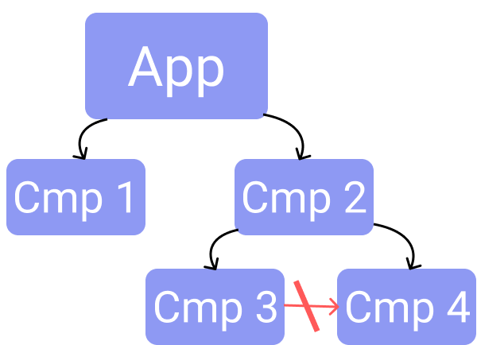

name: asynchronous_actions

class: cols, middle, main

.fifty.main-left[
# Interactive Front-end Development

by Artem Halas and Stanislav Deviatykh
]
.fifty.main-right[.main-circle[].secondary-circle[]]

???

Presenter display slide notes

Pre-lecture checklist

* Switching between mirroring and non-mirroring works
* Unrelated tabs and windows closed or minimized
* Do not disturb mode **ON**
* Slides cloned, one has presenters mode on
* Dependencies installed and scripts are working for lecture example code
* Terminal(s) open with code and window to run scripts

---

# Lecture 5

* Design recap
* Asynchronous processes
* Dispatch middleware

---

# Feedback

* Don't abuse `useEffect` , it's all about passing props
* Immutability in managing props and state is paramount!

---

# Reducer-based application recap 

* Generally useful pattern in both front and back end
* Can both be applied to whole applications and parts of an application

---

# Reducer-based application recap 

* Actions describe _what happened_ **not** _what to do_
* Refer to an Actor - User or External Service
* Simple, human-readable data structure
* Action history should read like prose

---

# Reducer-based application recap 

* Reducers must always be pure functions
* Keep reducers simple by keeping state minimal (de-normalized)
* Pure functions can be easily de-composed

---

# Recipe for adding new functionality

* Design high-level component tree and state object(s)
* Test and implement actions and reducers
* Test and implement views
* Validate functionality end-to-end
* Refactor

---

# Design choices

* Use props to make components re-usable
* Not all components have to be re-usable!
* Minimize components which control application-specific state

---

# Avoiding boilerplate

Use helper functions, include a functional programming library if necessary.

* Avoid writing arbitrary loops and object processors
* Use map, filter, reduce for clear and less-error-prone code
* [Ramda](https://ramdajs.com/)
  * Great documentation and function composition
  * [Hey Underscore, You're Doing It Wrong!](https://www.youtube.com/watch?v=m3svKOdZijA)
* [Lodash](https://lodash.com/) or [LodashFP](https://github.com/lodash/lodash/wiki/FP-Guide)

---

# Avoiding mutations

* Only use functions from Ramda/Lodash instead of JavaScript native functions
* Use [functional-programming linter](https://github.com/jfmengels/eslint-plugin-fp)
  * [Forbid the use of mutating methods](https://github.com/jfmengels/eslint-plugin-fp/blob/master/docs/rules/no-mutating-methods.md)
* [Immutable JS](https://facebook.github.io/immutable-js/)
  * Immutable JS collections spread throughout the application as conversion with native objects is costly.

---

# Context

.full-image[]

---
# Context


[Doc](https://reactjs.org/docs/context.html)
---

# Context

Context is designed to share data that can be considered "global" for a tree of React components,
such as the current authenticated user, theme, or preferred language.

```jsx
export const ServerContext = createContext({theme, language});
```

---

# Interacting with the outside world

--

A real-world application may interact with

* a back-end server through HTTP requests,
* a back-end server or other users through a WebSocket,
* internal timers which fire asynchronously

All of these occur asynchronously - at a later, unknown time

---

# Three actions in one

Usually **at least three actions** per asynchronous operation are necessary:

An action informing the reducers that

* a request **started**
* the request finished **successfully**,
* the request **failed**.

---

# Asynchronous code

Most modern asynchronous JavaScript APIs return a
[Promise](https://developer.mozilla.org/en-US/docs/Web/JavaScript/Reference/Global_Objects/Promise)

```js
// promise provider:
const p = new Promise((resolve, reject) => {
  // provider calls resolve/reject at a later time
});

// promise user:
p.then(
  (success) => console.log('success', success),
  (failure) => console.log('failure', failure)
);
```
---

# Asynchronous code

Promises can be chained

```js
const nextStepPromise = p.then(
  (success) => takeTheNextStep(success),
  (failure) => trySomethingElse(failure)
);
```

---

# Asynchronous code

Promises can be `await`ed on in [`async`
functions](https://developer.mozilla.org/en-US/docs/Web/JavaScript/Reference/Statements/async_function).
The `async` function returns a `promise`.

```js
const f = async (p) => {
  try {
    const response = await p;
    return takeTheNextStep(success);
  } catch (failure) {
    return trySomethingElse(failure);
  }
};
```

---

# Asynchronous code

Asynchronous processes are not tied to the "caller"

```js
const [commentsFromServer, setCommentsFromServer] = useState([]);

useEffect(() => {
  server.getComments()
    .then(
      ({comments}) => setCommentsFromServer(comment),
      (failure) => handleFailureSomehow(failure)
    );
}, []);
```

What is the problem here?

---

# Asynchronous code

Asynchronous processes are not tied to the "caller"

```js
const [commentsFromServer, setCommentsFromServer] = useState([]);

useEffect(() => {
  server.getComments()
    .then(
      // Component can be unmounted by now!
      ({comments}) => setCommentsFromServer(comment) ,
      (failure) => handleFailureSomehow(failure)
    );
}, []);
```

---

# Code example

* What kind of server to use is a cross-cutting concern. In React a "Context"
  can be used for dependency injection.
* [CommentListWithServer](https://github.com/urmastalimaa/interactive-frontend-development/blob/master/lecture_5/src/cross_cutting_concerns/components/CommentListWithServer.js)
* [CommentFormWithServer](https://github.com/urmastalimaa/interactive-frontend-development/blob/master/lecture_5/src/cross_cutting_concerns/components/CommentFormWithServer.js)

---

# Testing asynchronous code

* [https://jestjs.io/docs/asynchronous](https://jestjs.io/docs/asynchronous)
  * `done`
  * `return promise` 
  * `.resolves`/`.rejects`
  * `mockReturnResolvedValue` or `mockReturnRejectedValue` - for testing different promises
  * `async`/`await`
* Avoid long timers by passing fake server APIs, configuring delays with parameters
* `screen.findByXXX` returns a Promise in _@testing-library_
* `waitComponentToBeRemoved`

---

# Calling servers

Modern browsers support the [Fetch API](https://developer.mozilla.org/en-US/docs/Web/API/Fetch_API)

* [Server API example](https://github.com/urmastalimaa/interactive-frontend-development/blob/master/lecture_5/src/cross_cutting_concerns/ServerAPI.js)
* [Testing does not have to be hard](https://github.com/urmastalimaa/interactive-frontend-development/blob/master/lecture_5/src/cross_cutting_concerns/FakeServerAPI.js)

---

# Managing complexity in reducers

* As functionality grows, using "one function" to reduce the application state is not enough
* Pure functions can be easily de-composed
* [Reducer composition example](https://github.com/urmastalimaa/interactive-frontend-development/blob/master/lecture_5/src/cross_cutting_concerns/Comments.js)

---

# Managing complexity in hooks

* Hooks are just functions, users can define their own
* Hooks must follow naming convention and hook-calling rules
* Custom hooks can be detrimental to maintainability
  * They are not unfamiliar and can _do anything_
  * Must be comprehensively documented
* [Custom hook example](https://github.com/urmastalimaa/interactive-frontend-development/blob/master/lecture_5/src/cross_cutting_concerns/hooks/UseServerBasedOnParams.js)

---

# Cross cutting concerns

* Some operations - like logging - should execute without being tied to any component
* For many server-side libraries a **middleware** is
  * _...some code you can put between the framework receiving a request, and the framework generating a response_

---

# Cross cutting concerns

* Where could a middleware _live_ in a React application?
* Side effects cannot be executed in a reducer as it must be a pure function
* Solution: wrap `dispatch` in a composable manner [a la
  Redux](https://redux.js.org/api/applymiddleware#example-custom-logger-middleware)

---

# Cross cutting concerns

.full-image[]

.footer[_from [https://www.codementor.io/reactjs/tutorial/intro-to-react-redux-pros](https://www.codementor.io/reactjs/tutorial/intro-to-react-redux-pros)_]

---

# Cross cutting concerns

* Middleware can be used without incorporating Redux into an application
* Need to create a method to wrap the `dispatch` method from React's `useReducer`
* [Wrapper hook example](https://github.com/urmastalimaa/interactive-frontend-development/blob/master/lecture_5/src/cross_cutting_concerns/hooks/UseReducerWithMiddleware.js)
* [Middleware example](https://github.com/urmastalimaa/interactive-frontend-development/blob/master/lecture_5/src/cross_cutting_concerns/LoggingMiddleware.js)

---

# Reasons for middleware

* Logging
* Error reporting
* Asynchronous process managers
* Augmenting actions
* ...

---

# Curried functions

ES6 _curried_ functions can be defined with a short-hand:

```js
export const myMiddleware = () => (next) => (action) => {
  // Code that's executed for each action
};
```

--

It seems that it takes three arguments, but it actually is:
* a function that takes no arguments
  * and returns a function that takes one argument
      * and returns a function that takes one argument

---

.full-image[]

---

# Homework

* [Requirements](https://github.com/urmastalimaa/interactive-frontend-development/blob/master/homework/weather/exercise5.md)
* **Deadline 17/04/2022 23:59**
* Submit zipped file to [https://courses.cs.ut.ee/2021/react/Main/Submit](https://courses.cs.ut.ee/2022/react/Main/Submit)
* Make sure to handle **all states of asynchronous requests**: in-flight, failed and succeeded
* Don’t forget **tests**, they will form a part of the grade
* **Only submit what is yours**

---
<video width="100%" height="50%" controls>
  <source src="assets/lecture-5/hw-5.mp4" type="video/mp4">
  Your browser does not support the video tag.
</video> 
