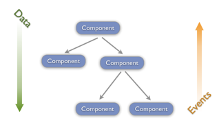
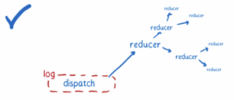

name: react_intro
class: middle, center

# Interactive Front-end Development

## Urmas Talimaa
## _Glia Inc (formerly SaleMove)_

???

<!-- Dummy notes to check presenter display  -->

Presenter display slide notes

Pre-lecture checklist

* Switching between mirroring and non-mirroring works
* Unrelated tabs and windows closed or minimized
* Do not disturb mode **ON**
* Slides cloned, one has presenters mode on
* Dependencies installed and scripts are working for lecture example code
* Terminal(s) open with code and window to run scripts

---

# Feedback

* When a React component is 50+ lines long, it’s time to refactor
                     
---

# Higher-Order Components

What is a high-order React component?

[Code Example](https://github.com/urmastalimaa/interactive-frontend-development/blob/master/lecture_4/src/higher_order_components/README.md)

---

# React and State

* Container components get complex very fast
* JSX obfuscates domain logic
* Domain logic should be separate from the view layer

---
  
# State

* **Value** - something that does not change
* **Identity** - A stable logical entity associated with a series of different
  **values** over time
* **State** - the **value** an entity with a specific **identity** has at a
  particular point in **time**
* **Stateful function** - If a function is invoked with same arguments at two
  different points in time and it returns different values then it has state.
  * Hint - it's also not a pure function
   
---

# Pure function and stateful function

Pure function: 
```js
const addOne = (x) => x+1;
```

Stateful function:

```js
private int _number = 0;
 function int addOne() {
   _number++;
   return _number;
}
```
   
---

# Stateful objects

* Objects can reach unexpected / illogical state
* Comparing stateful objects can be hard/expensive
* Hard to test
  * Need to foresee all possible states that can be
reached through mutation 
* Has side effects
  * Can change behaviour of other objects
* Poor concurrency support (Locking, ugh)
* Can be more memory efficient / faster
   
---

# Immutable objects - Values

* Easy to reason about
  * All possibilities are captured by parameters
* Easy to test
* Safe to change (create new objects from)
* Allow optimizations (e.g structural sharing, object caches)
* Excellent in concurrent environments
* Usually require more memory

---

# Final boss: mutable state

* Mutable state is hard to get right 
  * [State, You’re Doing It Wrong](https://vimeo.com/46276948)
* Every application has at least some mutable state. It is how you manage it
  that decides your happiness.

---

# Final boss: mutable state

Global, mutable state that you modify directly is:

* impossible to test and reason about
* very scary to use in new contexts or change existing usage places
* [https://programmers.stackexchange.com/a/148109](https://programmers.stackexchange.com/a/148109)

.right-image[]
      
---

# Final boss: mutable state

The moment you are afraid to change your own program is the time to rethink your methodology.

---
   
.full-image[]

---

# How do we want our state?

* Immutable
* Testable
* Traceable
* New state created in a predictable, explicit manner

---
  
# Flux

* [Flux](https://facebook.github.io/flux/) - a library for handling state
* [Flux concepts](https://github.com/facebook/flux/tree/master/examples/flux-concepts)
* An application architecture for React utilizing unidirectional data flow.
* It's a design pattern, rather than a framework - can be used with any view
layer (works best with declarative view layers)
      
---

# Flux

* User or external (server) interactions trigger **actions**, which contain
  information about the interaction (clicked where?).
* Actions are dispatched (sent) to a **store**.
* New **state** is created in store based on previous state and action data,
  change event is emitted on the store.
* **Views** can query store for new state when _change_ event triggers

* Stores are held in Container components

---

.right-image[]

From https://blog.krawaller.se/posts/react-js-architecture-flux-vs-reflux/

---
  
# How do we want our state?

* Immutable 
* Testable
* Easily viewable as a whole
* New state created in a predictable, explicit manner

---
  
# Elm and Elm architecture

* Elm is a programming language based on Haskell
* It uses a functional programming and makes heavy use of **pure functions**.
   
---

# Elm architecture

* Model - State
* Update - composition of pure functions called actions that transform the
  model
* View translates state to HTML

.right-image[]

---
   
# Redux put two and two together

* Inspired by Flux and Elm
* Works great with React
* The official docs are amazing. These slides are largely based on
  [https://redux.js.org](https://redux.js.org)
* Lots of great examples along with tests:
  [https://redux.js.org/introduction/examples](https://redux.js.org/introduction/examples)
* [Impression of Redux before v1.0 was released](https://blog.andyet.com/2015/08/06/what-the-flux-lets-redux/)

---
        
# Why Redux over Flux?

* One _store_ to rule them all
  Captures the whole application state
* Redux allows composing logic that changes state (_reducers_), similar to
  composing React components
* Supports server side rendering (one single store greatly simplifies things)
* Very small and simple, read the whole source!
* [Answered by the author](http://stackoverflow.com/questions/32461229/why-use-redux-over-facebook-flux) 
---
    
# Redux

* All application state is stored in a single object.
  This object is contained in a **store**.
  ```js
  const store = createStore(myReducer);
  ```
* Only way to change state is to dispatch an **action**,
  an object describing **what happened**.
  ```js
  store.dispatch({type: 'FOOD_DESIRED', payload: 'fries' });
  ```

---

# Redux

* Actions are interpreted by **reducers** which are **pure functions**
  ```js
  return {..state,
      shopping_list: state.shopping_list.concat([action.payload]) };
  ```
* You can **subscribe** to new states using the store
  ```js
  store.subscribe(() => 
      console.log('new state', store.getState()) );
  ```

---

# Redux introduction example

[Code example](https://github.com/urmastalimaa/interactive-frontend-development/blob/master/lecture_4/src/redux_introduction/README.md)
     
---

# Too many new toys?
  
.full-image[]

---

# Designing application state

State object is **read-only (never mutate state)**

* One application = one store
* Plain, serializable JavaScript objects
* Avoid putting non-serializable objects into state
  * If one object is non-serializable, the whole state is
* [https://redux.js.org/faq/organizing-state](https://redux.js.org/faq/organizing-state)

---
     
# Designing application state

* Every element must be stored only once.
* All references to objects must only refer to their identity (usually id)
* Exactly as **normalized database tables**

In essence, a redux store is a normalized, immutable front-end database.

---
  
# How to access state?

* Get the whole application state with `store.getState()`

  It is _safe_ to give access to all state as it cannot be directly changed.
* Listen to changes with `store.subscribe(myCallback)`

Isn't it nice when you can re-render all your views whenever anything changes?

---
  
# What is an action

An action describes _what happened_
It does not describe _what to do_ (domain logic)

* Actions are the **only** way to update the state of the application.
* Actions are plain (serializable) javascript objects (no class instances)
* Actions contain as little information as possible
* Actions are **dispatched** to the store
  
---

# Action examples

* User wants to like a post (different from user liked a post) 
  * NOT Increase like count by 1 for post X
* User wants to view comments for 24 March 2017 
  * NOT fetch comments for date X
* Object X was not found (404 from server) 
  * NOT show not found view
* A new post was successfully created in the server (post ID included in the payload)
  
---

# Redux action format

* [https://github.com/acdlite/flux-standard-action](https://github.com/acdlite/flux-standard-action)
* It’s specified for flux, but works great for Redux
* Human-friendly. Actions should be easy to read and write by humans.

```js
{
  type: 'ADD_TODO',
  payload: {
    text: 'Remember milk.'
  }
}
```

---
                           
# Action creators

* Actions are data - not code
* Define functions that create actions and constants for action types
  * Action type constants can be imported in reducers and matched against dispatched actions.
* Functions that create actions are called **action creators**
* Action creators do not have to be pure - possible place for side effects
  
---

# What is a reducer?

Reducer in general is a function that takes

* an object of type A and
* an object of type B
* returns an object of type A


* `reduce (+) 0 [1, 2, 3] => 6`
* `reduce (fn) initialState action => newState`

---

# Redux reducer

Reducer is a **pure function** that returns new state based on previous state
and an action. It contains application logic, interpreting how to change
application state whenever something (an action) happened.

---

# Redux reducer

* `(previousState, action) => newState`
* Reducers must always be pure. You should never do the following.
  * Mutate its arguments
  * Mutate state
  * Send HTTP requests
  * Call non-pure functions, e.g. `Date.now()` or `Math.random()`
* Reducer must return the old state if it does not handle a specific action.

---
      
# How to lose everything

* A reducer must never mutate state!
* No objects in old state should be mutated
  * ~~state.foo = 'bar';~~
  * ~~state.foos[1] = 'bar';~~
  * ~~state.foos.push(‘bar’);~~
  * Violating this will result in unexpected application behaviour
* Create new objects using [ObjectSpreadOperator syntax](https://redux.js.org/recipes/using-object-spread-operator)

---
             
# Reducer composition

Reducers can (must!) be composed

* One reducer manages one small slice of state
* Reducers are combined to handle total application state
* Composition of pure functions = pure function
* Reducers define the shape of your entire applications state.

[https://redux.js.org/basics/reducers](https://redux.js.org/basics/reducers)

---

# Composition

React component composition & Redux reducers composition

.horizontal_images[! ]

---
    
# Redux data flow

Redux architecture revolves around a strict **unidirectional** data flow.

* `store.dispatch(action)`
* Store calls the reducer (composition of reducers) to compute new state
* New state is saved inside store. `store.getState` now returns updated state.
* All `subscribe` callbacks are called
* [https://redux.js.org/basics/data-flow](https://redux.js.org/basics/data-flow)

---
    
# Using React with Redux

* Redux is not coupled with React, but works great with it
  * React bindings: [https://github.com/reactjs/react-redux](https://github.com/reactjs/react-redux)
* Use Redux in container components, leave presentational components as pure
  React
* React-redux provides the `connect` method to auto-generate container
  components
* `connect` creates an optimized React component that `subscribes` to store and
  re-renders view only when specified props change

---
    
# Using React with Redux

* `mapStateToProps(state, [ownProps])`
  return data props
* `mapDispatchToProps(dispatch, [ownProps])`
  return callback props (which can use _dispatch_)

Props returned from both methods are merged

```js
const ContainerComponent = ReactRedux.connect(
  mapStateToProps,
  mapDispatchToProps
)(PresentationalComponent)
```

---
               
# Selector functions

```js
const mapStateToProps = (state, ownProps) => { ... }
```

* Transform state to props for presentational components
* You can incorporate non-trivial calculations into this function
* Extract the calculations into separate, testable functions that are not
  react/redux specific!
             
---

# Using React with Redux

* Use a special component called `<Provider>` which will wrap your root
  component
* The `<Provider>` component automagically allows all your React components
  have access to store, so you don’t need to pass store object down as props to
  every component.
* [https://redux.js.org/basics/usage-with-react](https://redux.js.org/basics/usage-with-react)

---
    
# Redux TODO app example

* Look at example and study it until you understand every facet of it.
* [React-Redux Todo example](https://github.com/reactjs/redux/tree/master/examples/todos)
  * It has a lot of information
* It requires some time to wrap your head around
* It is all about pure functions
* All changes to state are explicit
 
---

# Example code

* [Comment App with Redux example](https://github.com/urmastalimaa/interactive-frontend-development/blob/master/lecture_4/src/redux_basics/README.md)
* [Comment App with composed reducers example](https://github.com/urmastalimaa/interactive-frontend-development/blob/master/lecture_4/src/redux_combine_reducers/README.md)

---

# Testing redux

* Reducers = pure functions = easy to test
* Autogenerated containers = no logic in them
  * No logic -> nothing to test
* Selector functions = pure functions = easy to test
* Action creators = mostly no logic
  * No logic -> nothing to test
  * Test logic in your actions creators as you would for any other JavaScript code
  
---

# Redux/React application layout

* Action creators in actions/
* Components in components/
* Containers in containers/
* Reducers in reducers/
* sub-folders for domain specific components
  
---

# Homework

[Requirements](https://github.com/urmastalimaa/interactive-frontend-development/blob/master/homework/thump/exercise4.md)

* Deadline 14/04/2019 23:59
* Submit zipped file to [https://courses.cs.ut.ee/2019/react/Main/Submit](https://courses.cs.ut.ee/2019/react/Main/Submit)
* Make sure you follow Redux core principles
* Tests will give a significant amount of points
* **Only submit what is yours**
